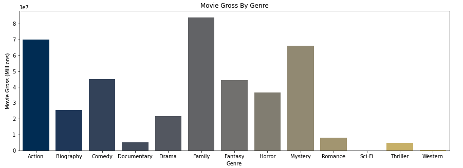
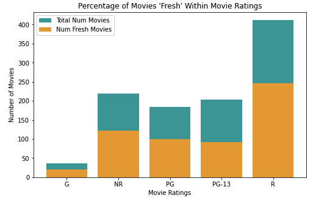

# <center>Microsoft Movie Studio</center>


# Overview

This project's goal is to explore movie analytics to provide actionable insights for Microsoft's new Movie Studio. My goal for this project was to help aid Microsoft in creating a baseline structure which will assist them in deciding what factors are important to take into consideration when producing films! 

My analyses show that movies under the genres Action, Family, and Mystery, on average, have a higher gross box-office income. But, as far as movie ratings go, Drama and Non-Fiction movies tend to, on average, get higher ratings. This tells us that while Action/Family/Mystery movies generally make more money in the box-office, they are not perceived as well by critics.

My analyses also explores movie ratings (G, PG, PG-13, R, NR) and the distribution of total movies made through each category, as well as how well, on average, they are perceived by critics. This data shows that R rated movies are made at a much higher rate and on average are rated 'Fresh' on Rotten Tomatoes more often than any other movie rating

As a bonus, I have explored the Top 10 Movie Directors by the number of films they have directed and analyzed their average movie rating. This has shown that Stephen Spielberg has both made the highest number of movies, as well as has the highest average ratings. This tells us that he would be a excellent director to partner with.


# Business Problem

**Questions I will be Analyzing:**
* What is the distribution of movie ratings and number of movies produced based on genres?
* What movie genre, on average, makes the most amount of money in the box office?
* What is the distribution for number of movies made by movie rating (G, PG, PG-13, R, or NR), and what percent of them get good ratings? 

* Who would an ideal director be to get involved in a movie project?
***

The answers to these questions will allow Microsoft to decide what genres they should focus on as far as how well its perceived by critics and how much money it makes in the box office. It would also provide insight into what movie ratings would follow how the movie industry is trending.


# Data Understanding

The data used in this project was gathered from IMDB, Rotten Tomatoes, and Box Office Mojo

* ```imdb_title_basics```: IMDB data consisting of title ID, primary title name, original title name (if fireign or known by something else), start year, runtime minutes, and a string of genres separated by a comma
* ```imdb_title_ratings```: IMDB data consisting of title ID, average rating, and number of votes

* ```rt_movie_info```: Rotten Tomato data consisting of ID (which correlates to a unique movie), synopsis, rating, genres, Director, and other data that was not used for the purpose of this project

* ```rt_reviews```: Rotten Tomato data consisting of ID (many reviews per movie ID), rating, fresh/rotten, and other data not used for the purpose of this project

* ```bom.movie_gross```: Box Office Mojo data consisting of movie title, studio, domestic gross, foreign gross, year

***

# Methods

This project uses exploratory analysis to find trends in Movie Data so to provide actionable insights to Microsoft for their new movie studio. 

I began my importing, merging, and cleaning the data that was gathered from IMDB, Rotten Tomatoes, and Box Office Mojo. I then carried out data analyses to generate visualizations and create concrete business recommendations for Microsoft in their endeavor to create a successful Movie Studio!


# Data

The genres with the highest rated movies are Non-Fiction and Drama. Horror movies has a very wide range of movie ratings


The genres with the highest grossing movies are Family, Action, and Mystery



R rated movies are the most common movies, as well as had the largest percentage of 'fresh' reviews by critic



# Conclusion

This analysis leads to **three recommendations** for movie productions:
1. Action or Family based on gross box-office income
2. Documentary or Biography based on viewer/critic ratings
3. R rated movie based on overall critic response

(Bonus would be to get Steven Spielberg to direct the movie, fortunately he directs a lot of Action/Sci-Fi movies, so this correlates to high gross box-office income as well)


# Next Steps

**Further Questions to Consider?**

* Who are some up of the top up and coming actors? People who have had a recent increase in roles and are expected to continue to thrive

* How have the popularities of genres changed over time? Number of movies for each genre over time? Ratings of each genre over time?


# Further Questions

See the full analysis in the [Jupyter Notebook](https://github.com/hannah-schurman/dsc-phase1-project/blob/main/microsoft_movie_analysis.ipynb) or review [this presentation](https://github.com/hannah-schurman/dsc-phase1-project/blob/main/Microsoft_Movie_Studio_Presentation.pdf)

For any additional questions, please contact Hannah Schurman at hannah.schurman1@gmail.com


# Repository Structure
```
├── Data
├── Images
├── README.md
├── microsoft_movie_analysis.ipynb
└── Microsoft_Movie_Studio_Presentation.pdf
```

